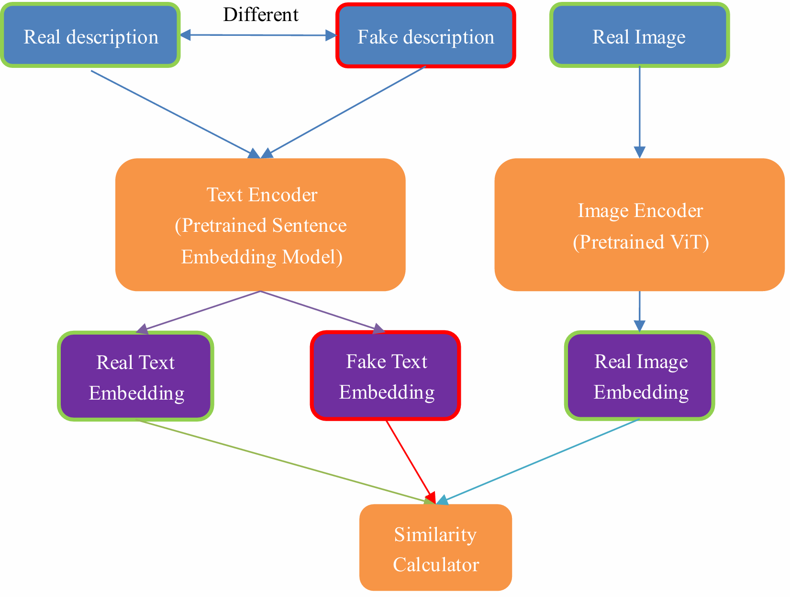
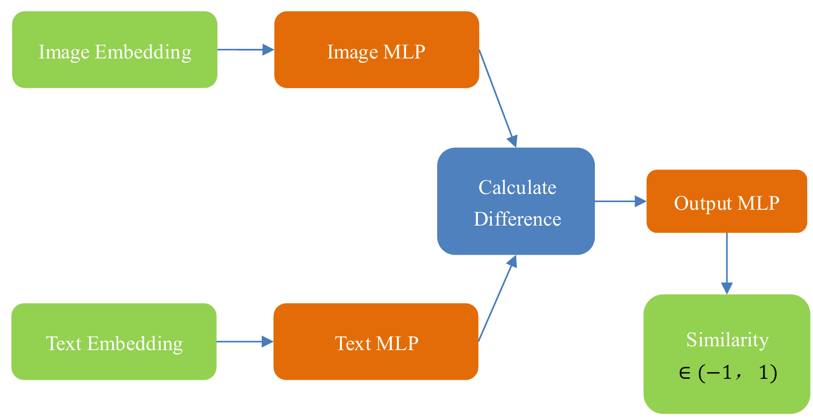

# Pretrained_Model_Alignment
将视觉预训练模型与文字预训练模型进行对齐，可用于零样本学习。Aligning visual pre-trained models with text pre-trained models. Can be applied to zero-shot learning.

## 项目介绍 (Project Introduction)
> both in Chinese and English. The translation is assisted by gpt.

在许多情况下，我们所拥有的资源仅仅是分别在文字或图片数据集上预训练好的单模态预训练模型。鉴于此，本项目的目标是通过少量的训练，使得两个不同模态的预训练模型（文字与图片）能够实现对齐。值得注意的是，本项目所用的对齐数据集并非类似于CLIP所需的海量“图像-描述”数据集，而是一个普通的图像多分类数据集。

本项目的核心思路是将图像多分类数据集中的类别转化为相应的文字描述，并运用对比学习的思想，为每张图片分配一个正确描述和一个错误描述（错误描述的内容不固定）。随后，分别计算这些描述的嵌入，并将其与图片的嵌入进行相似度比较。该项目的模型结构如图1所示。

---

In many cases, the resources we possess are merely unimodal pre-trained models that have been trained separately on either text or image datasets. Therefore, the objective of this project is to achieve alignment between two different modalities of pre-trained models (text and images) with minimal additional training. It is worth noting that the alignment dataset used in this project is not a large-scale "image-description" dataset like that required by CLIP, but rather a standard image classification dataset.

The core idea of this project is to convert the categories in the image classification dataset into corresponding textual descriptions and apply contrastive learning principles. For each image, a correct description and an incorrect description (with varying content) are assigned. Subsequently, the embeddings of these descriptions are computed and compared with the embeddings of the images for similarity. The structure of the model is illustrated in Figure 1.

**Fig 1. Model Structure**

除了常用的余弦相似度，本项目还设计了一个孪生神经网络相似度，使其在两个预训练模型嵌入维度不同的情况下也可用。其中两个孪生分支的参数可以相同也可以不相同（根据具体实验需求），模型结构如图2所示。

---

In addition to the commonly used cosine similarity, this project also designed a Siamese neural network-based similarity measure, which can be used even when the two pre-trained models have different embedding dimensions. The parameters of the two branches in the Siamese network can be either identical or different, depending on the specific experimental requirements. The model structure is illustrated in Figure 2.

**Fig 2. Similarity Model Structure**

## 如何使用 (How to use it)

1. 请首先克隆该仓库。
2. 下载AwA2数据集，下载链接为：[AwA2](https://cvml.ista.ac.at/AwA2/AwA2-data.zip)。该数据集包含50个类别，尽管数据集中为每个类别提供了详细的属性信息，但在实验中并未直接使用这些属性。我们在训练阶段对40个类别进行对齐操作，并在剩余的10个类别上进行测试，以验证模型在对齐后的零样本学习能力。请注意，将本项目提供的`Animals_with_Attributes2/class.txt`文件放置在数据集文件夹中。该文件将作为每个类别的描述使用，不过也可以使用同一文件夹中的其他三个描述文件进行实验（强烈建议实验`Animals_with_Attributes2/class_sentence.txt`文件）。
3. 下载预训练文本嵌入模型参数，并将其放置在weights文件夹中。本项目使用的是sentence_transformer库中提供的“all-mpnet-base-v2”模型。由于中国大陆地区在下载时可能存在代理问题，请注意修改代码。如果下载遇到困难，可以前往官方GitHub页面下载对应的压缩文件并解压。
4. 下载并解压提供的model-9.zip文件，将其解压为model-9.pth，这是预训练的图像嵌入模型参数。
5. 运行`train.py`脚本以开始训练。
6. 在实验过程中，我发现微调ViT模型并结合使用孪生神经网络相似度可以取得较好的效果。在训练过程中，需要注意选择较小的学习率，同时相似度网络的学习率应低于微调ViT模型的学习率（因为相似度网络的拟合速度较快）。

---

1. First, please clone the repository.
2. Download the AwA2 dataset from the following link: [AwA2](https://cvml.ista.ac.at/AwA2/AwA2-data.zip). This dataset contains 50 categories. Although detailed attributes for each category are provided within the dataset, these attributes are not directly used in the experiments. We align 40 categories during the training phase and use the remaining 10 categories for testing to validate the model's zero-shot learning capability after alignment. Please ensure that the `Animals_with_Attributes2/class.txt` file provided by this project is placed in the dataset folder. This file is used to describe each category; however, you may also experiment with the other three description files located in the same folder (it is strongly recommended to experiment with the `Animals_with_Attributes2/class_sentence.txt` file).
3. Download the pre-trained text embedding model parameters and place them in the weights folder. This project uses the “all-mpnet-base-v2” model provided by the sentence_transformer library. Please be aware that there may be proxy issues when downloading in mainland China, so make sure to modify the code accordingly. If you encounter difficulties downloading, you can go to the official GitHub page, download the zip file, and extract it manually.
4. Download and extract the provided model-9.zip file into model-9.pth, which contains the pre-trained image embedding model parameters.
5. Run the `train.py` script to begin training.
6. Through experimentation, we found that fine-tuning the ViT model combined with using the Siamese neural network similarity measure yields better results. During training, it is important to select a smaller learning rate, and the learning rate for the similarity network should be lower than that of the fine-tuned ViT model (as the similarity network tends to fit faster).

## If you have any question of the code, please contact me or leave an issue. My email:1793706453@qq.com
